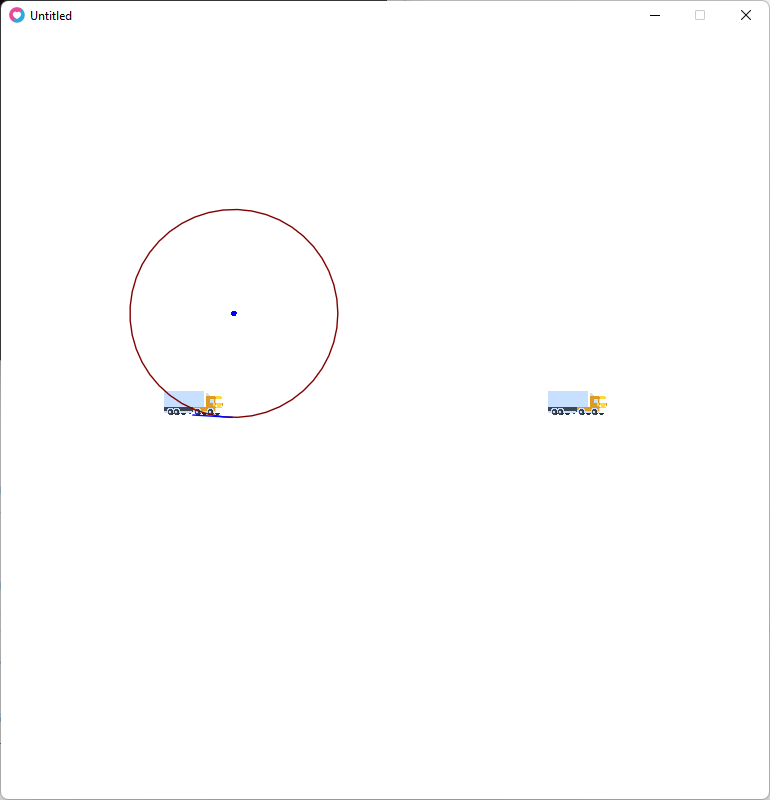
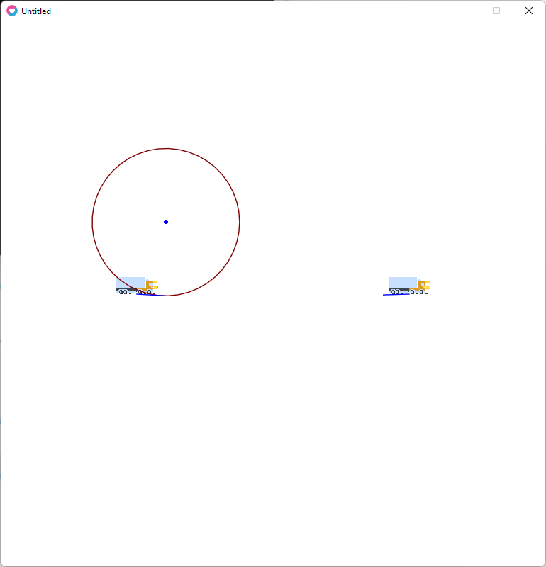
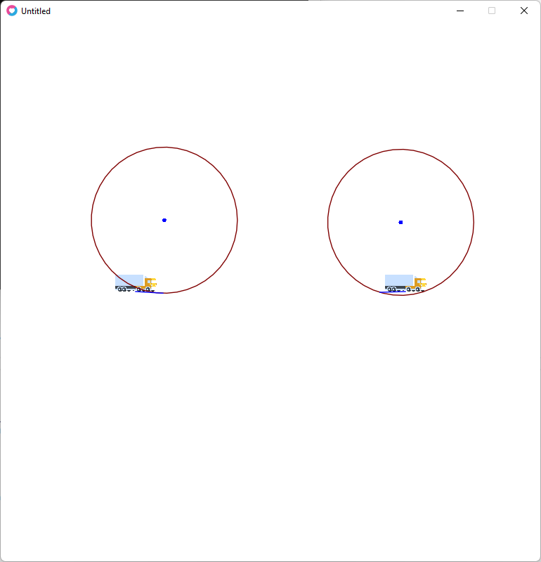
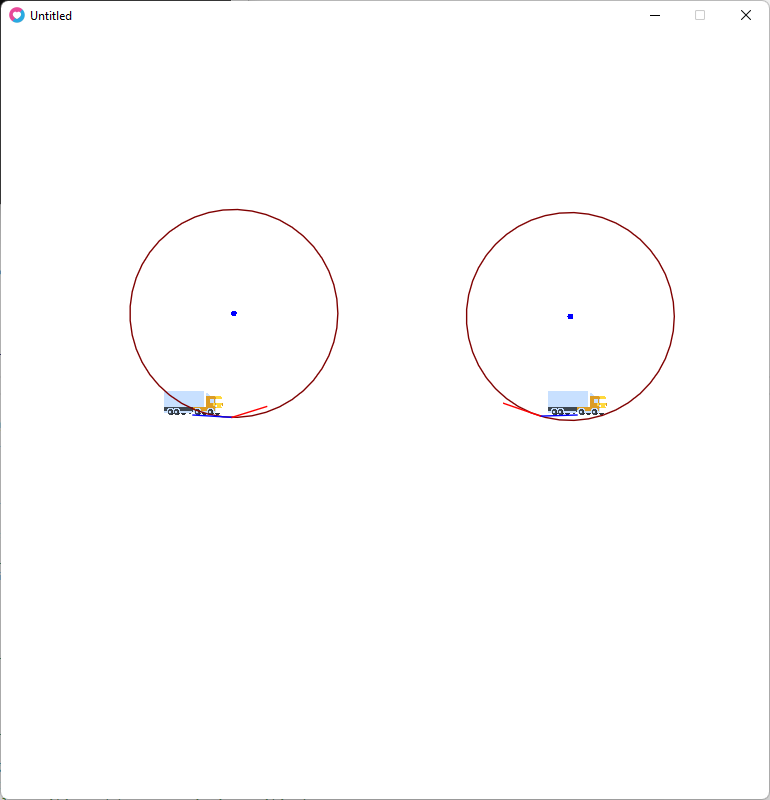
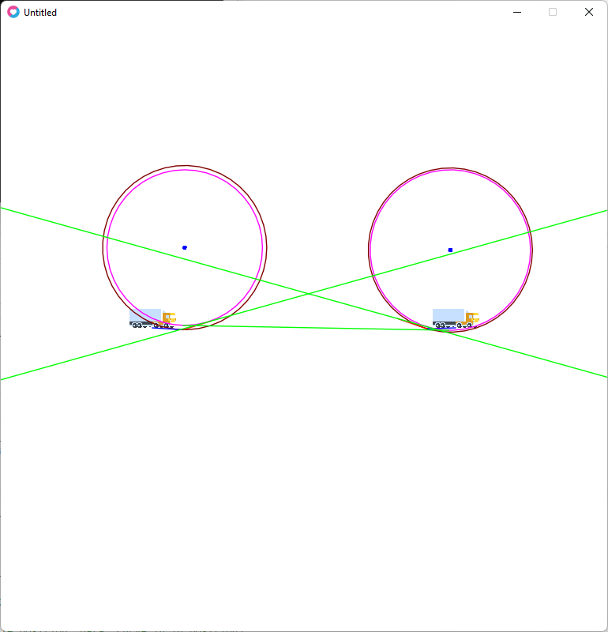
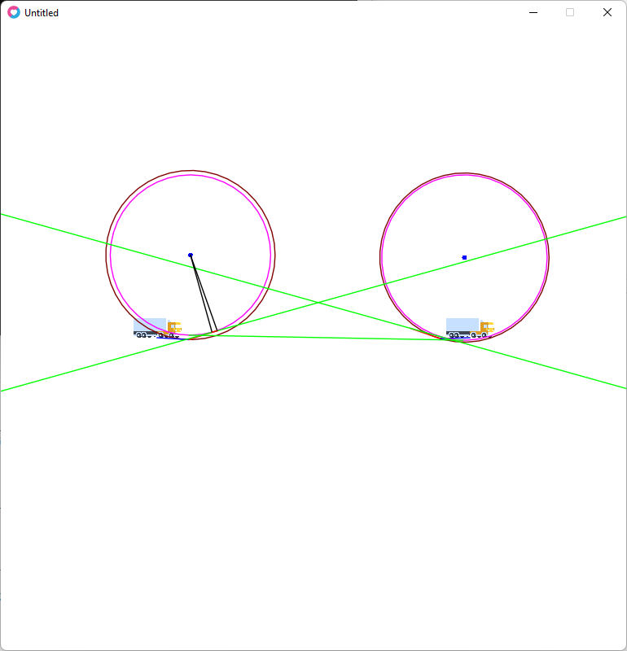
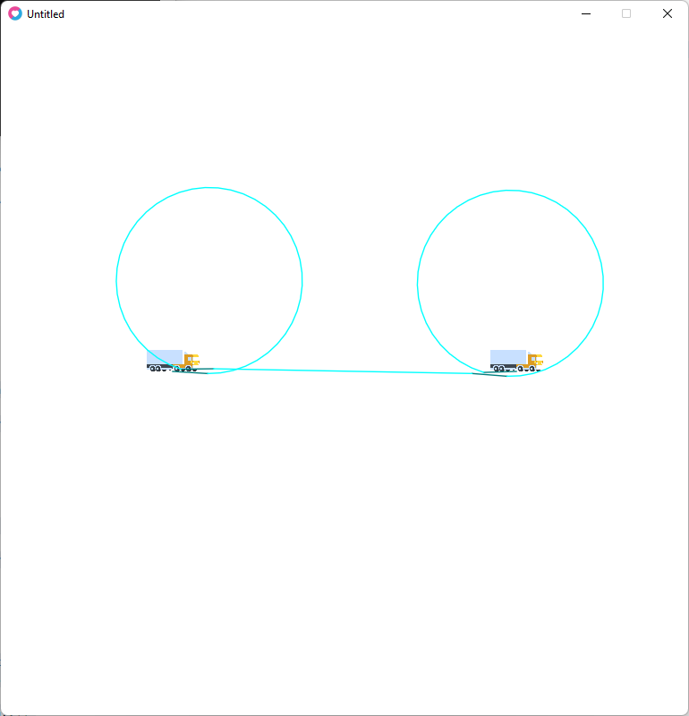

Dubins paths helped us plan the route of a vehicle that could instantly steer. Although not *super* elegant, it worked for the needs. 

The approach is no longer applicable when we deal with a vehicle that is *articulated* (*not* towed): this would look absolutely not natural and would cause confusion for the users. We needed to find an algorithm that would be applicable for letting the truck steer as it moves forward. 

By "crunching" data, we managed to know "where the truck will be if it moves at speed X when it is done steering", but simply integrating those values to the Dubins paths was not possible: the gist of the issue is in knowing when the vehicle needs to exit the first curve and when does it need to steer again to enter the last curve (we're assuming we reproduce the only four *words* of the Dubins paths algorithm that contain a *straight* segment).

Vocabulary/technicalities:
- a *Position* is a coordinate in the 2d plane
- an *Orientation* is an angle the vehicle is facing; in our case we assume x+ being 0, and all our angles are assumed to be in the range [0..2pi), increasing counter-clockwise
- a *Location* is a combination of a position and an orientation
- depending on the context, some locations are in local frame, some others are in the world frame

Let's assume we have as an input these values:

- `origin`: the position and orientation of the vehicle when it starts planning (world frame)
- `destination`: the position and orientation of the vehicle where it should be once it has moved (world frame)
- `ci_cii`: the offset in terms of the position and orientation of the vehicle between its starting position and the point where it will be steered, on the "turing circle" (local frame). ("circle in to curve in, in")
- `cio_si`: the offset in terms of the position and orientation of the vehicle between when it exits the first curve and is "straight" driving toward the last curve (local frame). ("curve in, out to straight in")
- `so_coi`: the offset in terms of the position and orientation of the vehicle between when it exits the "straight" and steers to be on the last curve (local frame). ("straight out to curve out, in")
- `coo_co`: the offset in terms of the position and orientation of the vehicle between when it exits the last curve and destination (local frame). ("curve out, out to circle out")
- `curve_in_radius`: the turning radius of the vehicle once it's fully steered for the circle_in
- `curve_out_radius`: the turning radius of the vehicle once it's fully steered for the circle_out

## We find the center of rotation of both circles. 

We find the center of rotation of the first circle by projecting where the vehicle will be once it's done getting from "straight" to "steering"; for this, the vehicle will move `origin` according to `ci_cii` to `curve_in_in`:

Then the turning radius for the first circle will be curve_in_radius (perpendicular to `curve_in_in`); we find the actual turning center `curve_in_center`:

Once the vehicle enters the curve, it will follow a path along this circle:

We do the same for the curve out, however, instead of assuming the vehicle will "be there" after it enters the curve, we assume that the vehicle "was there" when it decided to de-steer and exit the curve, so we find the location it was at that moment. For this we need to "move back" the vehicle according to coo_co.

Using the curve_out_radius, we find where the turning center is for the curve out, with the circle it will follow:

## We find the *straight* location

For the first circle, we need to find the Location pattern of the vehicle when it will exit the curve: we assume it exits right away after it has entered; we use curve_in_in and cio_si to find a_point_on_cic_si_circle:

We do the same for the circle out, where we assume the entry into the curve (we use curve_out_out and so_coi to find a_point_on_coc_so_circle):

Both of those are _Locations_: they have a position and an orientation. They represent the orientation of the vehicle when it will exit the first curve (along with its distance from the center of the curve), and the orientation of the vehicle when it will reenter the last curve (and the distance from the center). 

The computed orientations here need to align, this alignment will give us the _straight_ path the vehicle will follow.

Locations a_point_on_cic_si_circle and a_point_on_coc_so_circle are computed in world frame; we use them to find the closest position of the line they represent to their respective center: we use those distances to create "circles" to which a common tangent will give a hint to where the actual straight segment is located. 

## We find the straight enter/exit points

After finding the intersection points between each circle and this tangent, we also compute the distance between those points and where the curve_in out/curve_out in points are. 

For the sake of simplicity, we'll focus on the curve-in part.

We use the pythagorean theorem here: center/point-on-the-tangent form a right angle with point-on-the-tangent/curve-in-out, and center/curve-in-out will be longer than center/point-on-the-tangent (so we have our hypotenuse in center/curve-in-out). We're looking for the distance point-on-the-tangent/curve-in-out: curve_out_enter_radius_s.

This distance is added (or removed, depending on some factors) in the direction of the tangent to the intersection point: this gives us the point where the vehicle should exit the curve in. 

We do a similar computation for the curve out. 

With all those data points, we can convert them and feed them to whatever algorithm we're using.

## Extra notes

Like the Dubins algorithm, running the algorithm will give us the shortest path when using the smallest possible turning radius. That's unfortunately not exactly what we want: that will not give us *the shortest path*. 

To get something that looks like the shortest path, we approach this by trying the algorithm with varying values for the actual turning we will do. Where Dubins assumes we steer at the maximum, our algorithm will try increments of 10% of the maximum and find the optimal combination of steering value and *words* (by "optimal", we mean "shortest path"). 

This version of the algorithm doesn't deal well with perfectly straight paths. 
